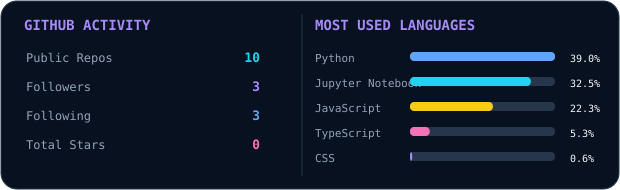

  <picture>
    <source media="(prefers-color-scheme: dark)" srcset="./dark.svg?v=2">
    <source media="(prefers-color-scheme: light)" srcset="./light.svg?v=2">
    
  </picture>

<strong>AI Researcher & Trainee · AI/ML Developer · Full-Stack Developer</strong> Building practical AI systems, intelligent applications, and full-stack projects.

---

## 👨‍💻 About Me

I'm **Ayak Manna**, a CSE-AIML graduate focused on **Artificial Intelligence, Machine Learning, Generative AI, backend engineering, and full-stack application development**.

I enjoy turning ideas into working software — from machine learning systems and AI-powered applications to complete web platforms.

---

### 🐍 Contribution Snake

  <picture>
    <source media="(prefers-color-scheme: dark)" srcset="https://raw.githubusercontent.com/Ayak-Here/github-snake/output/github-snake-dark.svg">
    <source media="(prefers-color-scheme: light)" srcset="https://raw.githubusercontent.com/Ayak-Here/github-snake/output/github-snake.svg">
    
  </picture>

---

## 🚀 Featured Projects

<table>
<tr>
<td width="50%" valign="top">

### 🤖 ComicCrafter AI

AI-powered comic generation platform combining language models, image generation, and full-stack development.

**Tech:** `Python` `FastAPI` `Next.js` `Groq` `Hugging Face`

</td>
<td width="50%" valign="top">

### 🩺 HealthPartner

Early disease prediction system using machine learning for healthcare-oriented risk analysis and explainability.

**Tech:** `Python` `Random Forest` `CNN` `Streamlit` `SHAP`

</td>
</tr>
<tr>
<td width="50%" valign="top">

### 📚 Study Buddy

AI-powered topic explanation application designed to make technical concepts easier to understand.

**Tech:** `Python` `Streamlit` `Groq`

</td>
<td width="50%" valign="top">

### 🌐 My Portfolio

Personal portfolio website showcasing projects and technical work.

**Tech:** `JavaScript` `Web Development`

</td>
</tr>
</table>

---

## 🛠️ Technology Stack

  
  
  
  
  

  
  
  
  
  

  
  
  
  
  
  
  

---

## 📊 GitHub Activity

  <picture>
    <source media="(prefers-color-scheme: dark)" srcset="./activity-dark.svg">
    <source media="(prefers-color-scheme: light)" srcset="./activity-light.svg">
    
  </picture>

---

## 🤝 Connect

  
  
  
  
  

Build · Learn · Experiment · Ship

