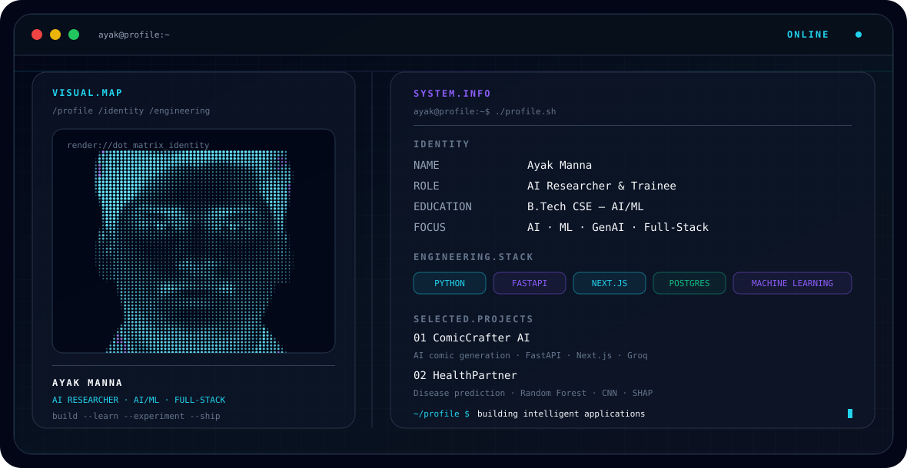

<p align="center">
  <picture>
    <source
      media="(prefers-color-scheme: dark)"
      srcset="./dark.svg"
    />
    <source
      media="(prefers-color-scheme: light)"
      srcset="./light.svg"
    />
    
  </picture>
</p>

<h1 align="center">Hi, I'm Ayak Manna 👋</h1>

<p align="center">
  <strong>AI Researcher & Trainee · AI/ML Developer · Full-Stack Developer</strong>
</p>

<p align="center">
  Building practical AI systems, intelligent applications, and full-stack projects.
</p>

<p align="center">
  <a href="https://github.com/Ayak-Here">GitHub</a> ·
  <a href="https://ayak.vercel.app">Portfolio</a> ·
  <a href="https://www.linkedin.com/in/ayak-manna">LinkedIn</a> ·
  <a href="https://x.com/mr_ayak7">X</a> ·
  <a href="https://www.instagram.com/ayak_manna">Instagram</a>
</p>

---

## `./about.sh`

I'm **Ayak Manna**, a CSE-AIML graduate from **Brainware University**, currently working as an **AI Researcher and Trainee**.

My main interests are **Artificial Intelligence, Machine Learning, Generative AI, backend development, and full-stack application development**.

I enjoy turning ideas into working software — from machine learning systems and AI-powered applications to complete web platforms.

```text
$ whoami

Ayak Manna

$ focus

AI / ML
Generative AI
Full-Stack Development
Backend Engineering
Intelligent Applications
```

---

## `./projects`

### 🤖 ComicCrafter AI

AI-powered comic generation platform combining language models, image generation, and a modern full-stack architecture.

**Stack:** Python · FastAPI · Next.js · Groq · Hugging Face

### 🩺 HealthPartner

Early disease prediction system using machine learning for healthcare-oriented risk analysis.

**Stack:** Python · Machine Learning · Random Forest · CNN · Streamlit · SHAP

### 📚 Study Buddy

AI-powered topic explanation application designed to make learning concepts easier through generative AI.

**Stack:** Python · Streamlit · Groq

### 🌐 My Portfolio

Personal portfolio website showcasing my projects, technical work, and development journey.

**Stack:** JavaScript · Web Development

---

## `./stack`

### Languages

`Python` `Java` `C` `C++` `JavaScript` `TypeScript`

### AI / ML

`Machine Learning` `Deep Learning` `Generative AI` `LLMs` `Computer Vision` `NLP`

### Backend

`FastAPI` `Python` `REST APIs`

### Frontend

`Next.js` `React` `Tailwind CSS`

### Databases

`PostgreSQL` `MySQL`

### Tools

`Git` `GitHub` `VS Code` `Streamlit`

---

## `./currently_building`

```text
┌──────────────────────────────────────────────┐
│ CURRENT WORK                                 │
├──────────────────────────────────────────────┤
│ AI-powered applications                     │
│ Machine Learning systems                     │
│ Full-stack platforms                         │
│ Generative AI projects                       │
│ AI research & experimentation                │
└──────────────────────────────────────────────┘
```

---

## `./github`

<p align="center">
  
</p>

<p align="center">
  
</p>

---

<h2 align="center">📊 GitHub Contributions</h2>

<p align="center">
  <picture>
    <source
      media="(prefers-color-scheme: dark)"
      srcset="https://raw.githubusercontent.com/Ayak-Here/github-snake/output/github-snake-dark.svg"
    />
    <source
      media="(prefers-color-scheme: light)"
      srcset="https://raw.githubusercontent.com/Ayak-Here/github-snake/output/github-snake.svg"
    />
    
  </picture>
</p>

---

## `./connect`

<p align="center">
  <a href="https://ayak.vercel.app">Portfolio</a> ·
  <a href="https://www.linkedin.com/in/ayak-manna">LinkedIn</a> ·
  <a href="https://x.com/mr_ayak7">X</a> ·
  <a href="https://www.instagram.com/ayak_manna">Instagram</a>
</p>

<p align="center">
  <sub>Building, learning, experimenting, and shipping.</sub>
</p>
